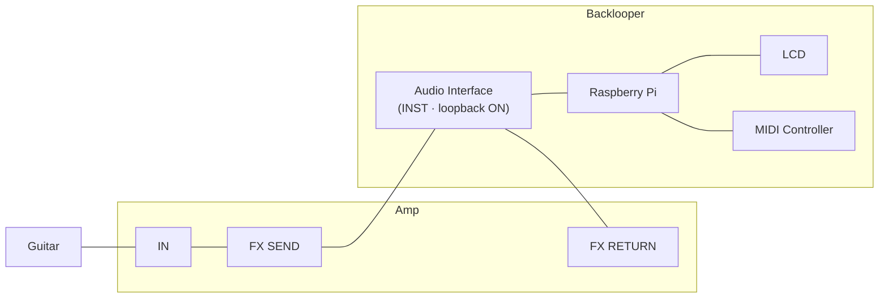

# Backlooper

A looper pedal that removes the need to think about when to start recording. Audio is captured continuously; press a button near the first beat of a bar and Backlooper loops the last N bars as if you had pressed it at the exact start.



The 16×2 LCD (HD44780 + PCF8574 I2C backpack) shows track states and status messages. Any USB MIDI device provides the controls.

## MIDI mapping

Hold any MIDI button for **5 seconds** to enter mapping mode. Press the physical control you want to assign:

| Slot | Type | Action |
|------|------|--------|
| Track 1–6 | button | press once: record last N bars and loop; again: stop at next bar; again: resume |
| Reset tracks | button | clear all tracks |
| Mute click | button | toggle click track on/off |
| Click volume | fader | click-track volume |
| Tempo | fader | BPM (60–200), only when all tracks are empty |
| Bars to record | fader | recording length: 1, 2, 4, or 8 bars |

After all slots are assigned, or after 5 s of inactivity, the map is saved and reloaded on the next run.

## Setup

Enable I2C in `raspi-config` and wire the LCD backpack (SDA/SCL + 5 V + GND).

Clone the repository, then register and start the systemd service:

```bash
bash ~/backlooper/scripts/install-run-on-startup.sh
```

The service runs `scripts/dev-setup-run.sh` on every boot: pulls the latest version, installs dependencies, and starts Backlooper. Logs:

```bash
journalctl --user -u backlooper -f
```

## Development

```bash
python -m pip install -e .
python -m backlooper
```

Device IDs are prompted on startup. Override with environment variables:
- `INPUT_DEVICE_ID` / `OUTPUT_DEVICE_ID` — integer device IDs (listed on startup)
- `MIDI_PORT_MATCH` — unique case-insensitive substring of a MIDI input port name

On a machine without `smbus2` or an I2C bus, LCD output falls back to log messages.

---

> **Note — legacy versions:** releases `0.x.y` ran on a laptop with a web frontend (WebSocket + browser UI). That approach required dragging a laptop to every session and has been deprecated in favour of the self-contained Raspberry Pi unit described above.
