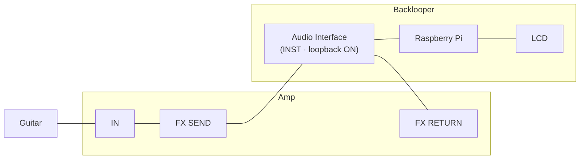

# Backlooper



Backlooper loops audio without having to trigger beforehand.
Audio is always being recorded.
The last few bars will be played back if you select a track at approximately the first beat of the next bar.

Status is shown on a 16×2 LCD screen connected via I2C (HD44780 + PCF8574 backpack).
Controls are provided by any class-compliant USB MIDI device (buttons + faders).

## MIDI mapping
Hold any MIDI button for 5 seconds to enter mapping mode.
The screen then walks through each slot in order — press the physical button or move the fader you want to assign:

| Slot | Type | Action |
|------|------|--------|
| Track 1–6 | button | toggle record → play → stop |
| Reset tracks | button | clear all tracks |
| Bars | fader | recording length: 1, 2, 4, or 8 bars |
| Volume | fader | click-track volume |
| Tempo | fader | BPM (60–200) |

After all 10 slots are assigned, or after 5 s of inactivity, the map is saved and reloaded on the next run.

## Development setup
Install the backend locally:

```commandline
python -m pip install -e .
```

Run the backend:

```commandline
python -m backlooper
```

The input and output sound device IDs are prompted on startup. To skip the prompts, set environment variables:
- `INPUT_DEVICE_ID` / `OUTPUT_DEVICE_ID` — integer device IDs (listed on startup)
- `MIDI_PORT_MATCH` — unique case-insensitive part of a MIDI input port name (omit to disable MIDI)

On a machine without `smbus2` or without an I2C bus, LCD output falls back to log messages.

Generate developer documentation locally:

```commandline
sphinx-build -M html docs build
```

### Running on a Raspberry Pi
Enable I2C in `raspi-config` and wire the LCD backpack to the I2C bus (SDA/SCL + 5 V + GND).

Setup before running:
```bash
ulimit -n 1048576  # workaround for https://github.com/spmvg/backlooper_backend/issues/3
export INPUT_DEVICE_ID=0
export OUTPUT_DEVICE_ID=0
export MIDI_PORT_MATCH="Your MIDI Device"
```